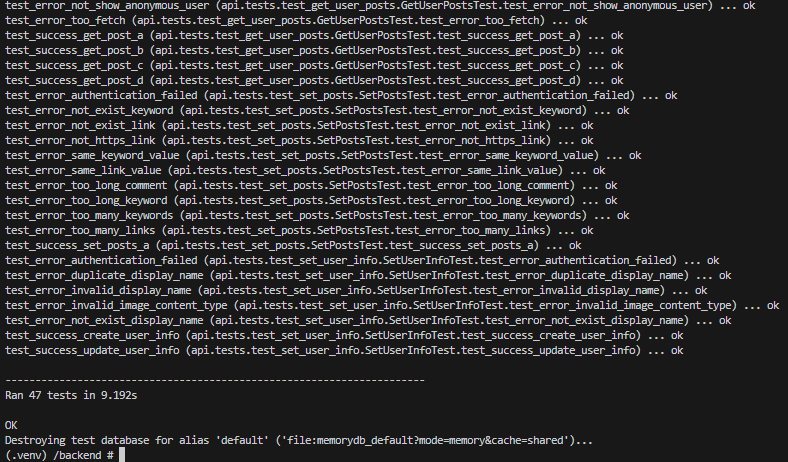

# Linkelli

## 概要
  

https://linkelli.net  
LinkelliはWebサイトのリンクを通して知識や情報を共有することを目的に作成されたSNSです。  
ユーザーネームやアイコンを設定できますが、匿名での投稿も可能なので、気軽にお試しください。  
Google、またはGithubアカウントからでのログインが可能です。  
## 開発環境
開発環境は以下のとおりです。  
- フロントエンド：React(nodejs:18.17.1, React:18.2.0)
- バックエンド：Django(python:3.11.5, Django:4.2.3)
- データベース：MySQL 8.1.0
- Webサーバー：Nginx
- 環境構築：Docker  

開発環境は以下のコマンドでDockerコンテナを立ち上げて作成します。  
```
docker-compose -f docker-compose.dev.yml up -d
```  

Djangoは手動でサーバーを立てる必要があるので、コンテナにアタッチして以下のコマンドを入力します。  
```
source ./.venv/bin/activate  
python ./manage.py runserver 0.0.0.0:8000
```  
Djangoのコンテナ上でAPIのテストケースを実行できます。  
```
python manage.py test api.tests -v 2
```  
以下のように各APIのテストケースが実行され、テストがすべてokを出力していれば問題ありません。  

  


実際にlocalhost上で動かす場合にはGoogleとGithubのAPIキーが必要なので、"./backend/"下に.envファイルを以下のフォーマットで作成します。  
```
google_client_id=<google_cliend_id>
google_secret=<google_secret>
github_dev_client_id=<github_dev_client_id>
github_dev_secret=<github_dev_secret>
```

## 今後追加予定の機能
- ブックマークを作成する機能
- 週間、月間のトレンドキーワードを表示する機能
- メールアドレスを用いたサインアップ、ログイン機能
