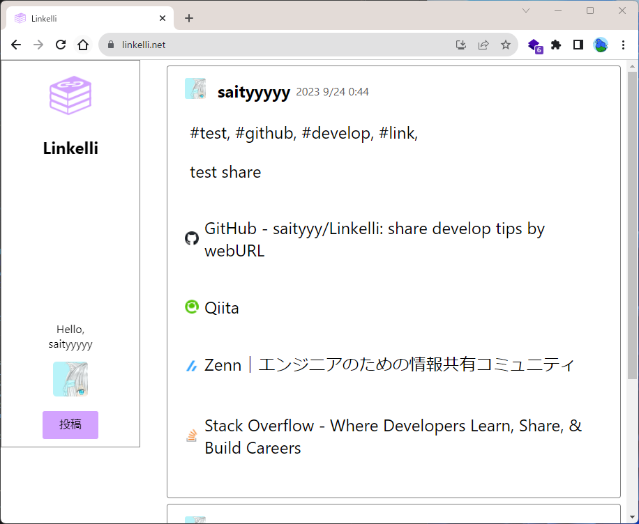

# Linkelli

## 概要
  

https://linkelli.net  
LinkelliはURLリンクを通して知識や情報を共有することを目的に作成されたSNSです。  
基本的にユーザーネームやアイコンを設定できますが、匿名での投稿も可能なので、気軽にお試しください。  
Google、またはGithubアカウントからでのログインが可能です。  
## 開発環境
開発環境は以下のとおりです。  
- フロントエンド：React
- バックエンド：Django
- データベース：MySQL
- Webサーバー：Nginx
- 環境構築：Docker  

開発環境は以下のコマンドでDockerコンテナを立ち上げて作成します。  
```docker-compose -f docker-compose.dev.yml up -d```  

Djangoは手動でサーバーを立てる必要があるので、コンテナにアタッチして以下のコマンドを入力します。  
```
source ./.venv/bin/activate  
python ./manage.py runserver 0.0.0.0:8000
```  

GoogleとGithubのAPIキーが必要なので、"./backend/"下に.envファイルを以下のフォーマットで作成してください。  
```
google_client_id=<google_cliend_id>
google_secret=<google_secret>
github_dev_client_id=<github_dev_client_id>
github_dev_secret=<github_dev_secret>
```

## 今後追加予定の機能
- ブックマークを作成する機能
- 週間、月間のトレンドキーワードを表示する機能
- メールアドレスを用いたサインアップ、ログイン機能
